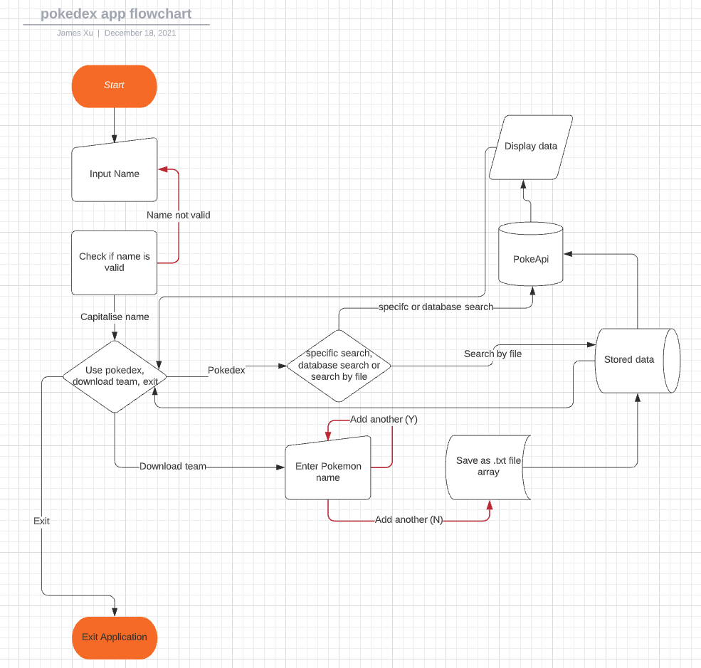
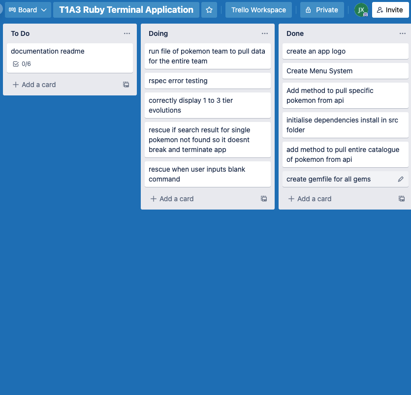
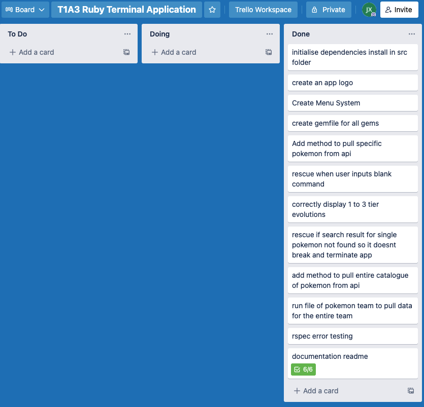

# PokeDex
Link to this repo can be found here: https://github.com/jamesxu1996/PokeDex
<hr/>

## Installation Instructions

1. Access the repository from the link: https://github.com/jamesxu1996/PokeDex
2. Access the `src` folder.
3. Run the `install-dependencies.sh` file in the terminal. This can be done like `sh install-dependencies.sh`

```sh
cd src
sh install-dependencies.sh
``` 
Following these commands will install the required gem bundler and associated gems.

The Pokedex application can then be run `sh run.sh`

**System Requirements**
- AT LEAST Ruby v2.4
- Runs on Windows, Mac OS or Ubuntu

**Dependencies**
- json
- colorize
- tty-prompt
- poke-api-v2
- rmagick
- paint
- ascii-image

<hr/>

## Purpose & Scope

The Pokedex application provides the user with a powerful tool which pulls from a Pokemon api (PokeApi v2) via the command prompt/terminal.  The user will be able to access information about every single Pokemon within the franchise through various methods such as a direct search, browsing through a selection of names and even constructing a team of Pokemon which data can be pulled concurrently.

The problem this application solves is that it allows Pokemon fans a quick and simple way of viewing their favourite Pokemon without needing to navigate through complex menu systems or having to worry about other information/systems which may distract or take away from the end user's experience. The reason this app is being developed is mainly due to my love of Pokemon; having a powerful tool which lets you see any Pokemon at any time is highly satisfying.

The target audience of this application will be young children, teenagers or adults; basically anyone who is a Pokemon fan or a real data nerd. Anyone who finds enjoyment in the franchise or viewing interesting information in an easily digestible form will appreciate the Pokedex.

In the most common use case of this application, a user will have a Pokemon in mind and directly insert that into the system's search function. This will in turn provide an output to the terminal which will display all the required information of that Pokemon. There is also another method of searching which is via a list; the user may type in letters which can filter out specific Pokemon and then choose from that list. This is helpful in the case that the user is not aware of the exact spelling of the name but has a general idea. Furthermore, users can have fun by scrolling through the list and viewing Pokemon which they may not know exists. 

## Features

There are several main features of this Pokedex App. These include a direct search feature, a categorical search with filter feature and a Pokemon downloader feature which can then be parsed through the application and JSON data files of those Pokemon will be saved.

The direct search feature allows the user to, as the name suggests, directly input a Pokemon name and in turn be met with the relevant data of that Pokemon. An image of the Pokemon sprite will also be brought up to give a visual cue as what the Pokemon looks like. The data will be presented in a key => value format and any incorrect search will give an error message to the user.

The categorical search method allows the user to filter through the entire list of Pokemon names by typing a sequence which will then bring up Pokemon names starting with that sequence of letters. For example, typing in char will run a filter and provide names which begin with char. This method is useful for users who want to view new Pokemon which they have yet to discover or are not completely sure of spelling.

Another major feature of the application is the ability to enter Pokemon names and have them saved in an array which represents Pokemon 'teams'. These saved arrays can then be parsed through the application and then have data pulled in accordance to the names. The application will then be able to save data as a JSON file and save these. This is useful for those who would like to perform additional data manipulation with Pokemon (e.g entering in an excel spreadsheet) or who simply want to save information about their favourite teams.

## Outline 

The application was designed with simplicity at its core. The menu system has limited choices and functionality is kept as basic as possible while still satisfying the user's needs. 

The menu at the start screen presents three options: Use Pokedex, download team or exit. Use Pokedex will direct the user to the next set of options: search specific pokemon, browse pokemon database, search pokemon with file and go back. 

From the first set of options, if the user chooses to download team, they will be prompted to enter a pokemon name and then prompted if they want to add another. The user will keep getting prompted to add another after each name entry until NO is selected; where the user will be returned to the home menu screen. The user can find the entered pokemon names in an array saved in the file directory. 

By choosing search specific pokemon, the user will be prompted to enter a single name which will return the corresponding data. Browsing the pokemon database will provide a filterable list which when selected, a specific pokemon's details will be outputted. Search pokemon with file will prompt the user to select a specific pokemon file which has been saved using the previously mentioned 'download pokemon team' option. This will then provide a saved JSON file of the corresponding pokemon in that array. Selecting go back or exit will do as the option says; taking the user back to the home screen or exiting the application.

The flowchart below shows how the application operates:


## Implementation Plan

The Trello board was the main tool which was used throughout the development of this application. Each feature was broken down into its main components and added to the board. This planning tool helped me to realise the scope of project and to think about what would or would not be possible in the given time frame.

Progression of the board looked like this





A log of all git commits can be found here: [Git Log](src/log.txt) 
